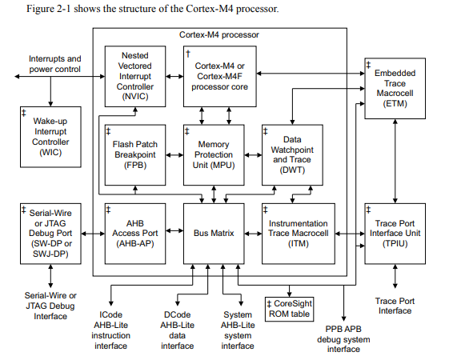
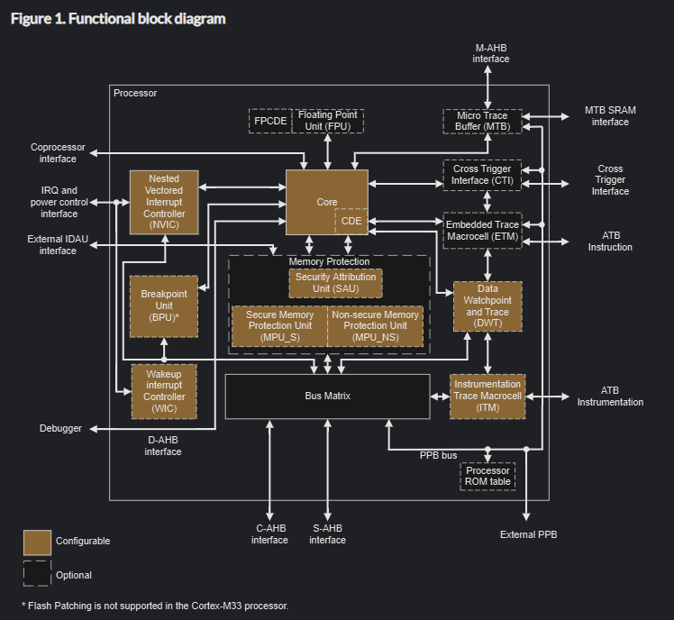

# Processor vs Processor Core
- We will be considering the Technical Reference Manual for the information regarding the Processor and the Processor Core.

- [Technical Reference Manual Cortex M4](https://users.ece.utexas.edu/~valvano/EE345L/Labs/Fall2011/CortexM4_TRM_r0p1.pdf)

# Processor
- Processor = Processor Core + Peripherals(NVIC, Flash Patch Breakpoint, MPU, etc.)

- Core consists of the ALU where data computation takes place and result will be generated.

- It has the logic to decode and execute an instruction.

- It has many registers to store and execute an Instruction.

- It has pipeline engine to boost the instruction execution.

- It consists of the hardware multiplication and division engine.

- Address generation unit.

- Cortex M talks to the outside world using the various Bus Matric such as `ICode AHB-Lite Instruction Interface`, `DCode AHB-Lite Data Interface` and `System AHB-Lite System Interface`.
