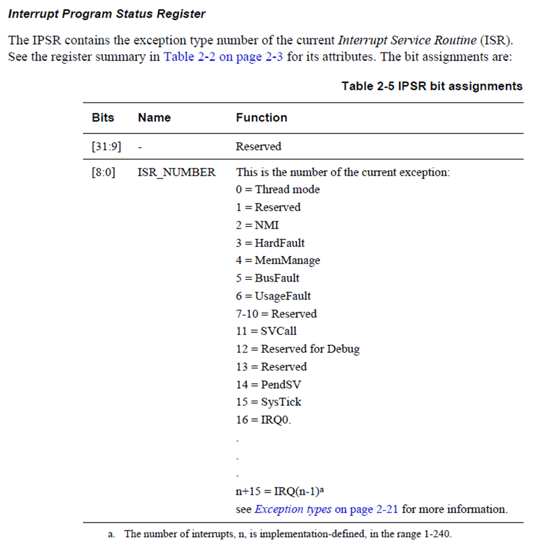
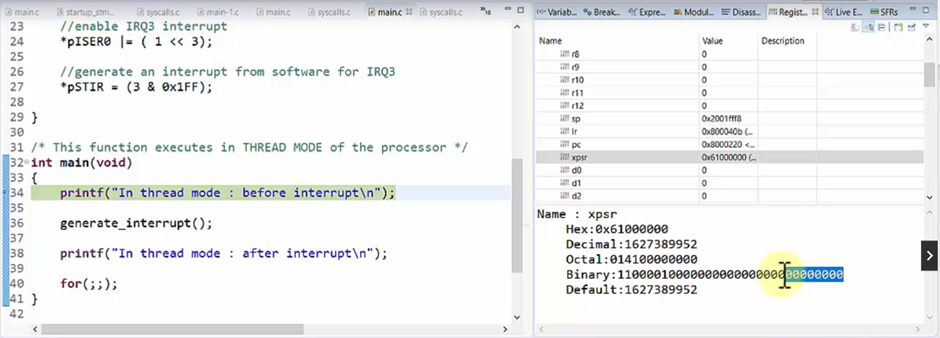
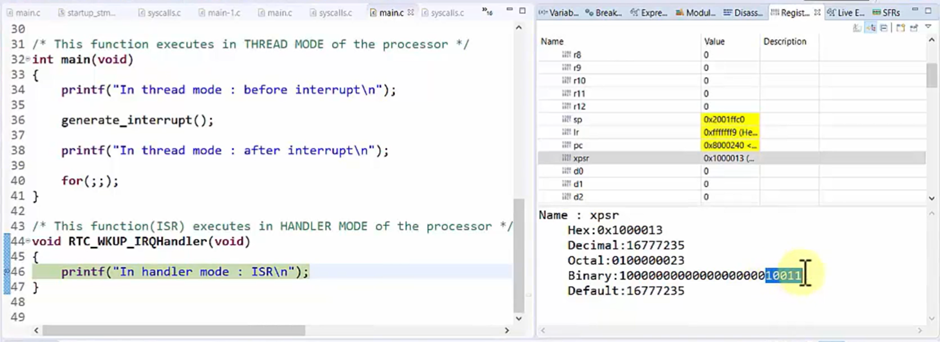

# Operational modes and access levels (Demonstrations)
- When we reset the processor, the first function which is executed is the Reset Handler.

- It further calls the main function and the processor starts in thread mode(user mode).

- All the `Handler functions` such as `RTC_WKUP_IRQHandler` are executed in the `Handler Mode` but all the functions except the Handler functions are executed `Thread Mode or User Mode`

## Handler Functions
```c
/* This function(ISR) executes in HANDLER MODE of the processor */
void RTC_WKUP_IRQHandler(void)
{
	printf("In handler mode : ISR\n");
}
```

## Other Fucntions
```c
/* This function executes in THREAD MODE of the processor */
int main(void)
{
	printf("In thread mode : before interrupt\n");
	generate_interrupt();
	printf("In thread mode : after interrupt\n");
	for(;;);
}

/* This function executes in THREAD MODE of the processor */
/* This function triggers the software interrupts by accessing the system level registers */
void generate_interrupt()
{
	uint32_t *pSTIR  = (uint32_t*)0xE000EF00;
	uint32_t *pISER0 = (uint32_t*)0xE000E100;

	//enable IRQ3 interrupt
	*pISER0 |= ( 1 << 3);

	//generate an interrupt from software for IRQ3
	*pSTIR = (3 & 0x1FF);

}
```

## Handler Mode
1.	In `Handler mode` we have `full control over the register`, we can touch any resource we want, we can change the interrupt configurations, system level registers and modify the control registers since Handler Mode has privileged level access. 

2.	Thread mode also has privileged level access, and it is the reason we are able to change the system specific register of the processor.

3.	We can only make thread mode code as unprivileged but not handler mode code.

4.	We can check that the program is executing in the Handler Mode or not using Interrupt Status Register. @Cortex M4 User Guide.

## Interrupt Program Status Register
- Interrupt Program status Register tells us that the Interrupt is now Triggered, its bit field changes when the interrupt is triggered. If the IRQ is hit then the IPSR[0:8] becomes 16.

- According to the User Guide the first 8 bits represent the Interrupt and the number represented by 8 bits is 19 and thus it refers to IRQ3 since 16 represents IRQ0.

- [Interrupt Program Status Register for Cortex M33](https://developer.arm.com/documentation/100235/0100/The-Cortex-M33-Processor/Programmer-s-model/Core-registers/Combined-Program-Status-Register/Interrupt-Program-Status-Register)



- While debugging the code observe the xpsr register in the Registers section in Cube IDE in Debug Mode.





- The only way to move the processor from the thread mode to the Handler Mode is when the processor undergoes a system level exception or interrupt.

- When the exception or the interrupt occurs the processor goes to the Handler Mode, then it excecutes the exception routine or the Interrupt Service Routine(ISR).

- The access level of the processor is always Priviledged in the Handler Mode. We can access any resource in the priviledged mode.
