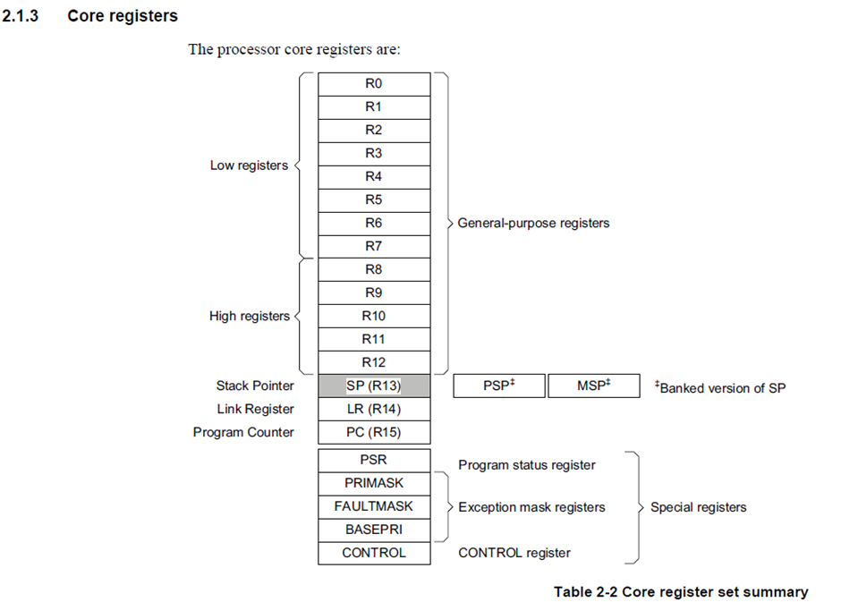
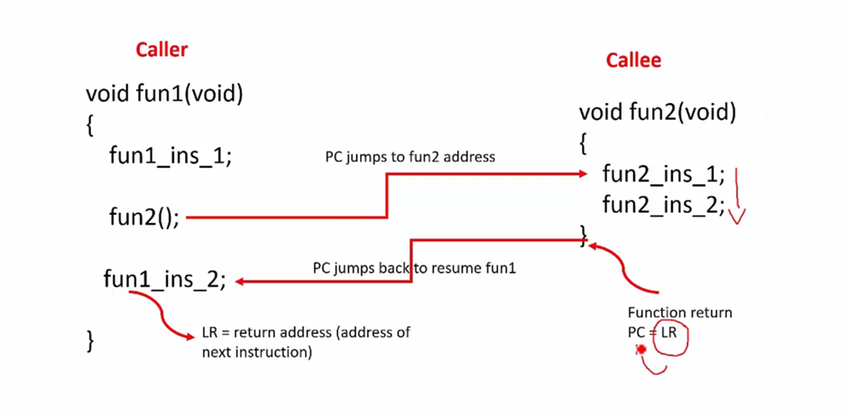
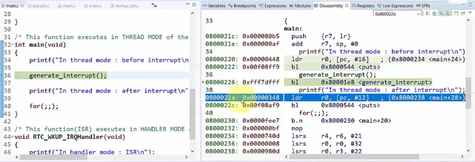
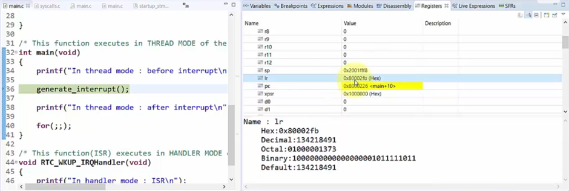
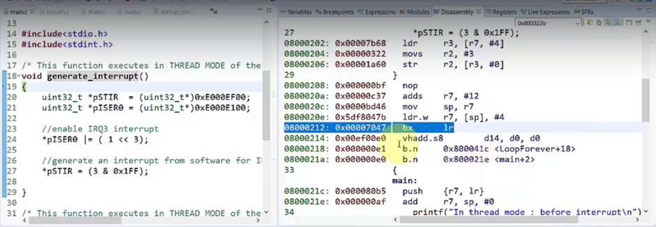
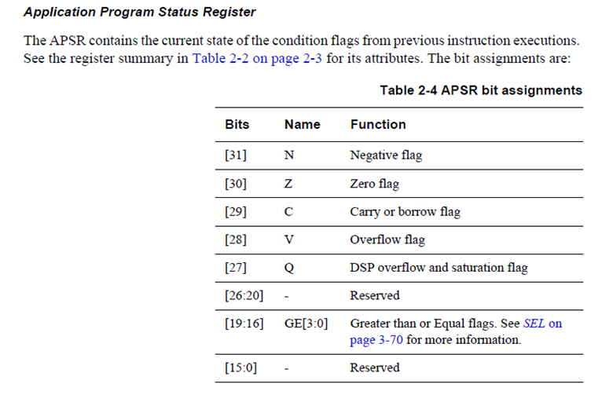
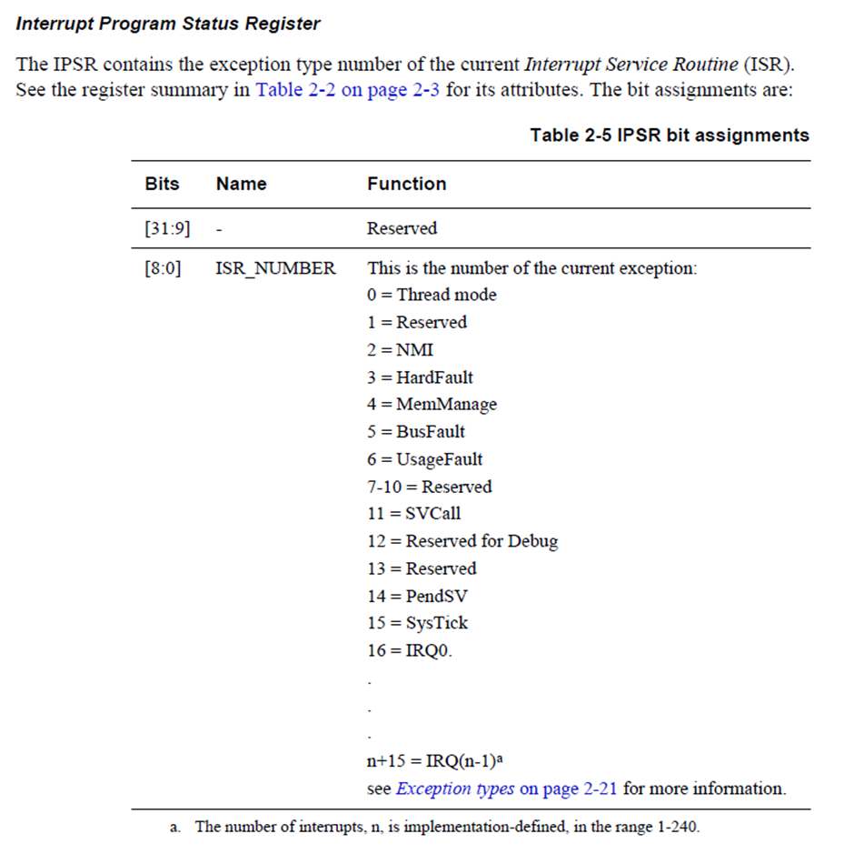
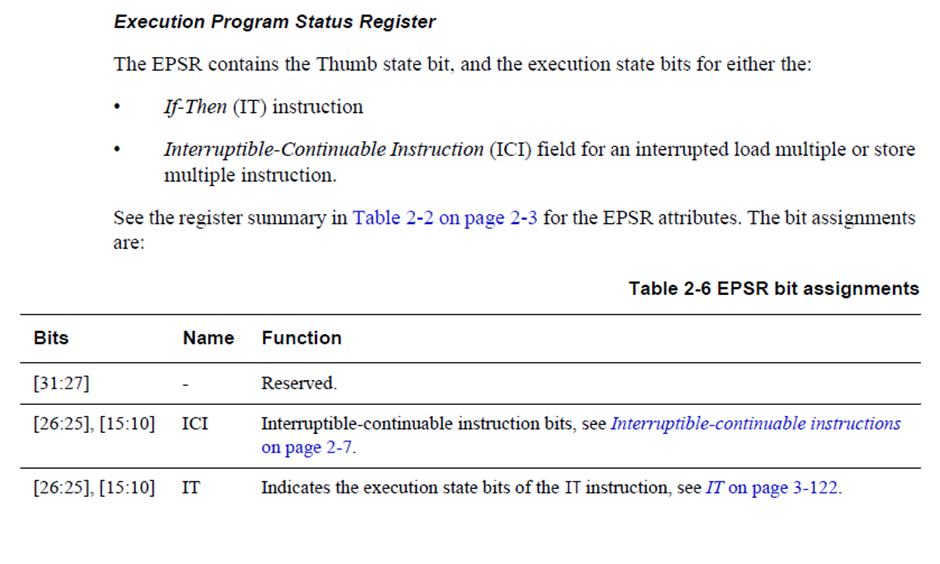
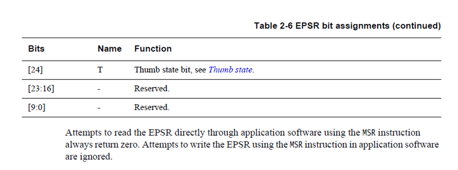

# Core registers of the Processor

- [ARM Cortex M33 Core Registers of the Processor](https://developer.arm.com/documentation/100230/0004/functional-description/programmers-model/processor-core-registers-summary).

- These registers are present in the Core of the CPU.

1. `General Purpose Registers` i.e. R0 to R12 (total 13) registers are for general purposes i.e. data operations. All the core registers are 32 bit wide.

2. `Stack Pointer` i.e. R13 is used to keep track of the stack memory, besides these there are other 2 registers: 
   1. Process Stack Pointer(PSP) 
   2. Main Stack Pointer(MSP)

    - These are called Banked version of Stack Pointer, one of these will be active depending upon the mode of the processor.

    - The Stack Pointer (SP) is register R13. In Thread mode, bit[1] of the CONTROL register indicates the stack pointer to use:
        - 0 = Main Stack Pointer (MSP). This is the reset value.
        - 1 = Process Stack Pointer (PSP).
    
    - On reset, the processor loads the MSP with the value from address 0x00000000.

3. `Linked Register` is used to hold the return information during the function call and exception handling. The Link Register (LR) is register R14. It stores the return information for subroutines, function calls, and exceptions. On reset, the processor sets the LR value to 0xFFFFFFFF.

    

    

    - bl means branch with link. When we use branch with link the link register gets updated with a written address.

    - The Program Counter loads the address of the next instruction to be executed in every case but the linked register comes into picture when the function call is made like `fun2();`, the linked register will hold the address of the `fun1_ins_2;`, since it has to be executed after the fun2()'s execution.

    - The Linked Register hold the address of the code line after the function call.

    

    

    - At the end of the generate function bx is used which means branch indirect and the value of LR is copied in the PC.

4. `Program Counter` i.e. the register R15 holds the address of the current instruction to be executed. 
    - On reset, the processor loads the PC with the value of the reset vector, which is at address 0x00000004. 
    - Bit[0] of the value is loaded into the EPSR T-bit at reset and must be 1.

5. `Special Registers` there are 5 special registers.
    1. `Program Status Register` (PSR)
       - It holds the status of the current execution of the program.It is a collection of three different registers.
    
       1. `Application Program Status Register(APSR)`
       

       2. `Interrupt Program Status Register(IPSR)`
       

       3. `Execution Program Status Register (EPSR)`
       
       

- If the T bit of the EPSR is set(1), processor thinks that the next instruction which it is about to execute is from Thumb Instruction Set Architecture(ISA).

- If the T bit of the EPSR is reset(0), processor thinks that the next instruction which is about to execute is from ARM Instruction Set Architecture(ISA).

- Since ARM Cortex Mx executes/supports only Thumb Mode i.e. Thumb Instruction Set Architecture(ISA), so for ARM Cortex Mx Processor the value of the T-bit should always be 1.

