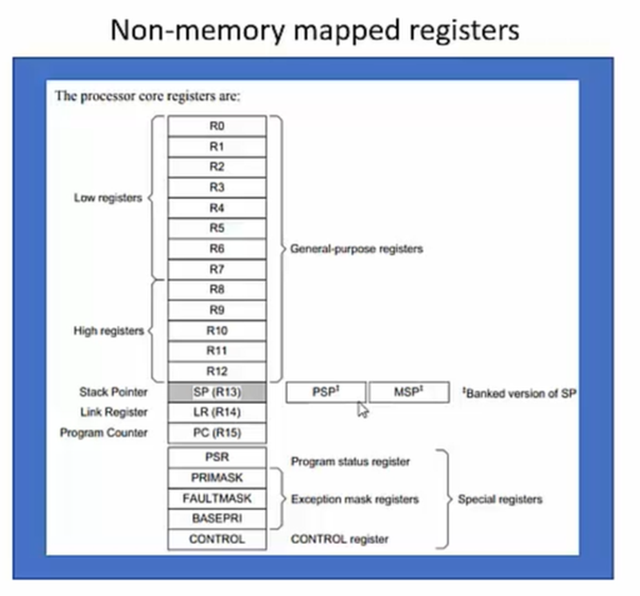
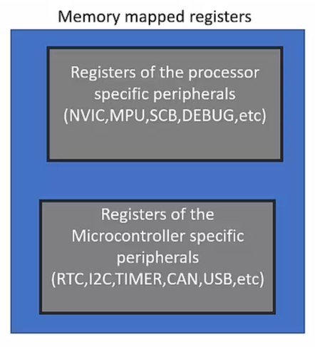

# Memory Mapped vs Non-Memory Mapped Registers

## Non-Memory Mapped Registers
- These registers are internal to the processor i.e. the processor registers such as the General Purpose Registers, Stack Pointers, Link Registers, Program Counters, Control Registers hence these are non-memory mapped registers because we do not have their unique address to access them.

- They are not a part of the processor memory map.

- These cannot be accessed in a C program using address dereferencing.

- To access these registers, we must use assembly instructions.

## Memory Mapped Registers
- Every register has its address in the processor memory map.

- We can access these registers in a ‘C’ program using the address dereferencing.

