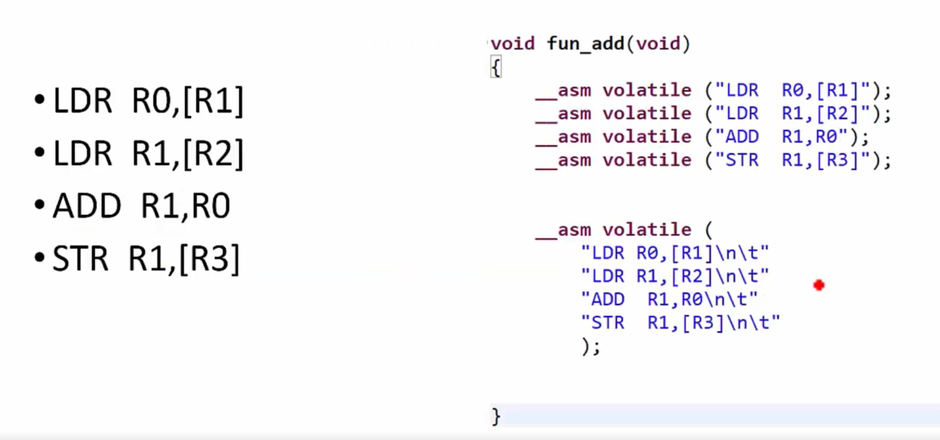
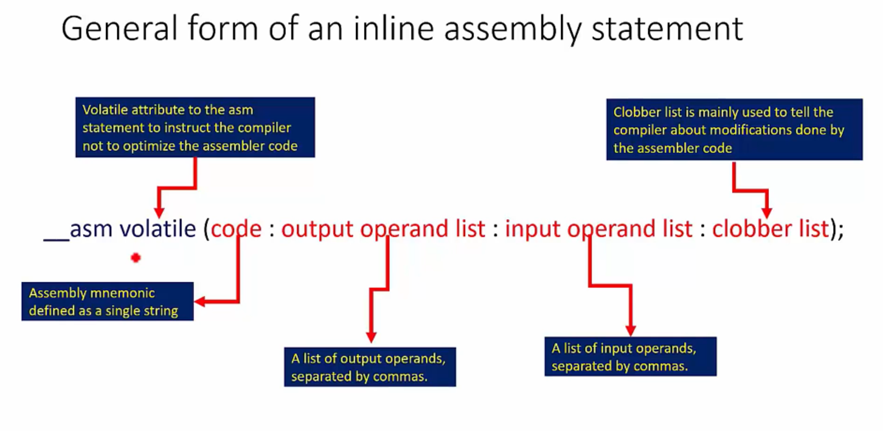
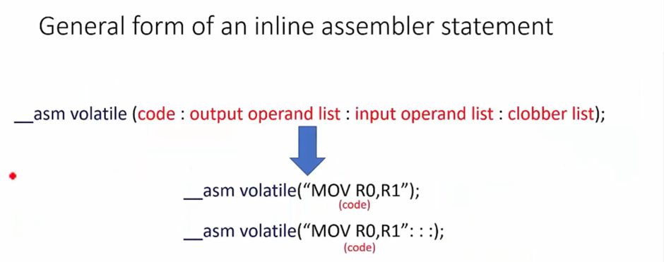

# ARM GCC inline Assembly Code Usage
- Inline Assembly Code is used to access the processor’s core registers or non-memory mapped registers such as General Purpose Registers (GPR), Stack Pointer(SP), Linked Register(LR), Program Counter(PC) and Special Purpose Register(SPR) etc.

- GCC Inline assembly code is used to write pure assembly code inside a ‘C’ program. GCC inline code syntax is shown below :
    - `Assembly Instruction`: MOV R0, R1
    - `Inline Assembly Instruction`: __asm volatile(“MOV R0, R1”);



```c
void fun_add(void)
{
    __asm volatile ("LDR R0, [R1]");
    __asm volatile ("LDR R1, [R2]");
    __asm volatile ("ADD R1, R0");
    __asm volatile ("STR R1, [R3]");
}
```

```c
void fun_add(void)
{
    __asm volatile(
        "LDR R0, [R1]\n\t"
        "LDR R1, [R2]\n\t"
        "ADD R1, R0\n\t"
        "STR R1, [R3]\n\t"
    );
}
```

- C variable and Inline assembly
    - Move the content of the `C variable data` to ARM register `R0`.
    - Move the content of the CONTROL register to C variable `control_reg`.



