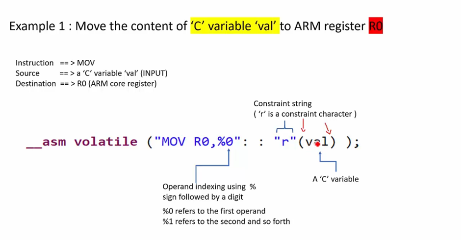
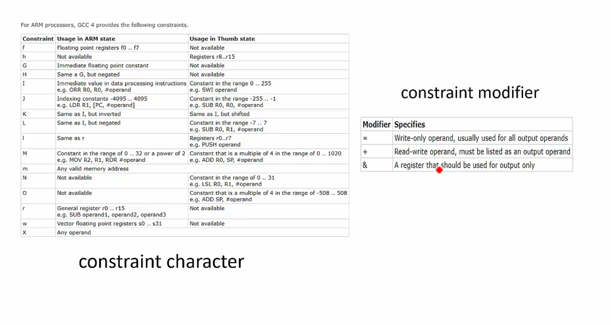
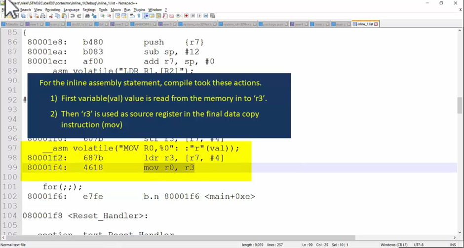
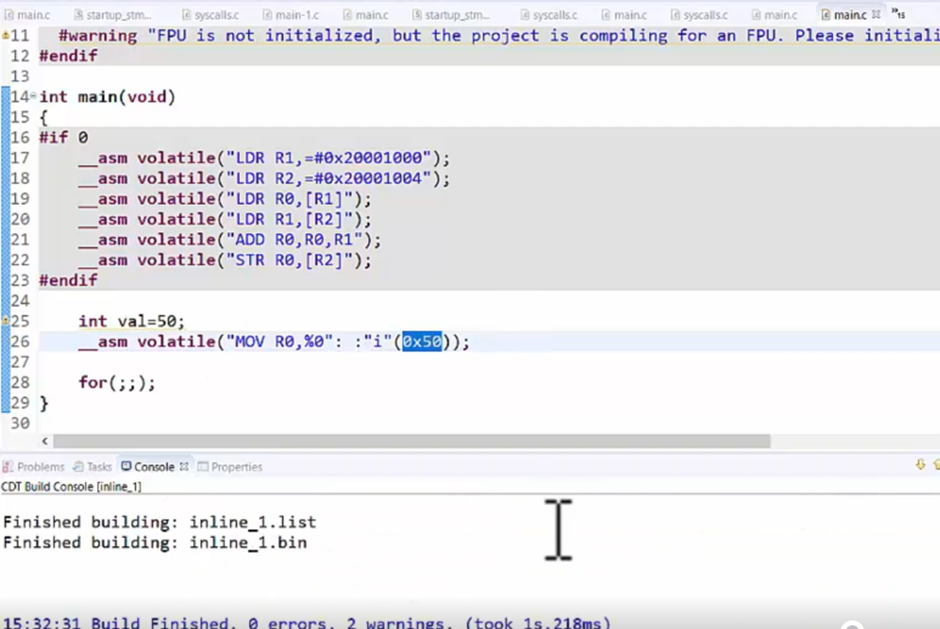

## Input/Output operands and Constant string
- Each input and output operand is described by a constraint string followed by a C experssion in parentheses.

### Input/Output operand format:
- "<Constraint string>" (<'C' expression>)

Constraint string = constraint character + constraint modifier

### Example 1:
Move the content of the 'C' variable 'val' to ARM register R0

`Instruction` ==> MOV
`Source` 		==> a 'C' variable 'val' (INPUT)
`Destination` ==> R0 (ARM core register)

```c
	__asm volatile ("MOV R0, %0": : "r"(val));
```





```c
int main()
{
#if 0
	__asm volatile("LDR R1,=#0x20001000");
	__asm volatile("LDR R2,=#0x20001004");
	__asm volatile("LDR R0,[R1]");
	__asm volatile("LDR R1,[R2]");
	__asm volatile("ADD R0,R0,R1");
	__asm volatile("STR R0,[R1]");
#endif

	int val = 50;
	__asm volatile("MOV R0, %0": :"r"(val)); /* "r" is the constraint string in this 
												and has to be written in double quotes */
    __asm volatile("MOV R0, %0": :"i"(0x50));
	for(;;);
}
```

- .list file contains the assembly code for the file compiled.





