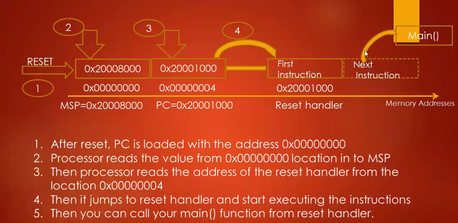

# Reset Sequence of the Cortex-M Processor
1.	When we reset the processor, The Program Counter(PC) is loaded with the value 0x0000_0000.

2.	The processor reads the value at memory location 0x0000_0000 in to the MSP.

    MSP = value@0x00000000, MSP is the Main Stack Pointer register.
    That means the processor first initializes the stack pointer, it store the highest address
    of the RAM in the stack decrement operation mode in the Cortex Mx architecture because the
    CPU should know that till what address the RAM grows.

3.	After this, processor reads the value @memory location 0x0000_0004 in to the Program Counter
    which is the value of the Reset Vector(Address of the Reset Handler).

4.	Program Counter PC jumps to the Reset Handler.

5.	A Reset Handler is just a C or assembly function written by user to carry out any initialization required.

6.	From the Reset Handler we call the main() function of the application.

