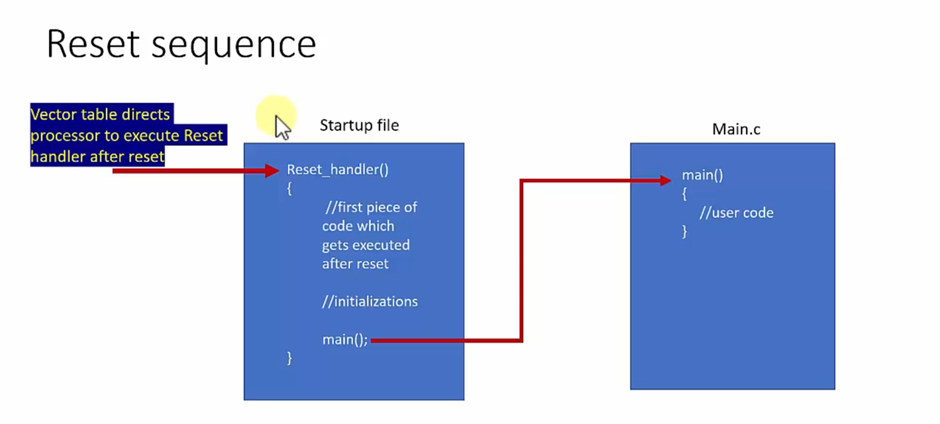
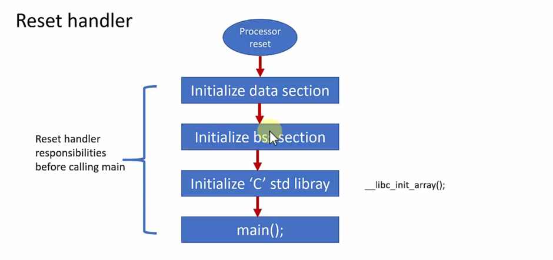

# Reset Sequence of the Cortex-M Processor

## Reset Handler
1. Reset Handler is implemented in the startup file of the Project, every project has a startup file present in it.

2. Reset Handler does the early initialization in our project, like `data section`, `bss section` and `c standard library` initialization.

3. After the Reset Handler the control goes to the main function, and the program execution starts.

