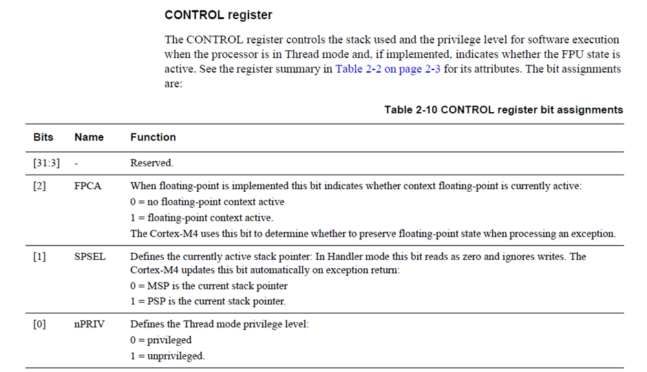
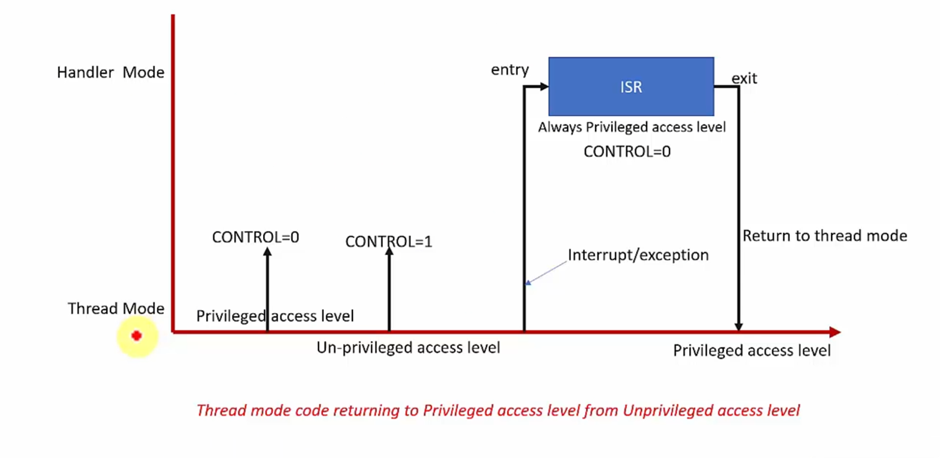

## Access Level Demonstrations
1. The program execution starts in Thread Mode(User Mode) + Privileged Access Level.

2. The idea is to change the access level of the processor and check if the processor is able to system level registers.

3. The processor should not be able to change the system level registers after it is in Non-Privileged Access Level.

4. The Use Case of this project is that: 
   - If there is a FreeRTOS based project then the project will have 2 components:
     1. Kernel Task
     2. User Task

   - The User Task should not modify the system level settings of the processor.
   - The User Task should not turn off any interrupts, it will fail the whole system.
   - The Kernel can change its setting to unprivileged, then it will launch the user task.

5. The Real Time operating Systems or Secured Systems always launch the user task in unprivileged access level.

6. If the unprivileged code wants any system level services, then it can trigger system calls.

7. System call will be serviced by the Kernel Code.




```c
/*
 * Change the access level of the processor.
 */
void change_access_level(void)
{
    /* These are some ARM Cortex M4 processor's system control register
     * addresses which can only be accessed in the privileged access level.
     *
     * Any attempt to change the contents of these registers from being in
     * unprivileged access level will cause a processor fault exception.
    */

    /* Read the Control Register */
    __asm volatile("MRS R0, CONTROL");
    
    /* Modify the Control Register's 0th bit which is nPRIV
     * If it is set to 1, the processor goes to unprivileged mode.
    */
    __asm volatile("ORR R0, R0, #0x01");

    /* Write the Control Register */
    __asm volatile("MSR CONTROL, R0");
}

/*
 * Generate Interrupt function executes in THREAD MODE of the processor
 */
 void generate_interrupt(void)
 {
    uint32_t *pSTIR = (uint32_t *)0xE000EF00;
    uint32_t *pISER0 = (uint32_t *)0xE000E100;

    /* Enable IRQ3 Interrupt */
    *pISER0 |= (1 << 3);

    /* Generate an interrupt from software for IRQ3 */
    *pSTIR = (3 & 0x1FF);
 }


int main()
{
    printf("In Thread Mode : Before the Interrupt");

    change_access_level();

    generate_interrupt();

}

void HardFault_Handler(void)
{
    printf("Hard Fault Handler");
    while(1); 
}
```

## How to switch back from the Unprivileged Access Level to Privileged Access Level?
- Change the Mode of the System from `Thread Mode` to `Handler Mode`.
- In the `Handler Mode` we can execute the Interrupt Service Routine(ISR), in the ISR we can change the system level registers.
- Then we can return to the Thread Mode again.


