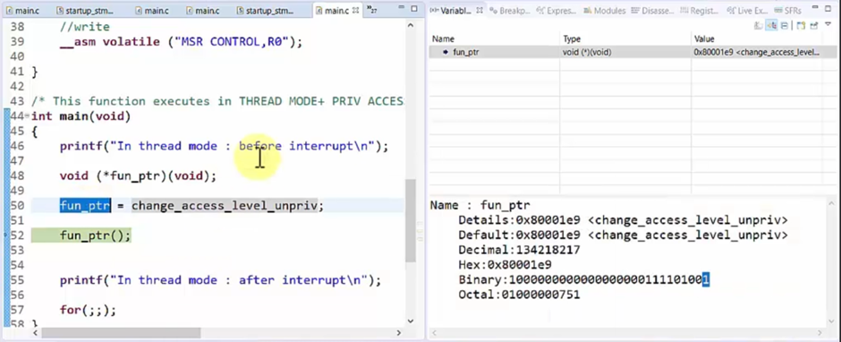

# T Bit of the Execution Program Status Register
1.	Various ARM processors support ARM Thumb interworking, i.e. the ability
    to switch between ARM and Thumb state.

2.	The processor must be in ARM state to execute instructions which are
    from ARM ISA and the processor must be in Thumb state to execute the
    instructions from Thumb ISA.

3.	If the T bit of the EPSR is set(1), processor thinks that the next 
    instruction which it is about to execute is from Thumb ISA.

4.	If the T bit of the EPSR is reset(0), processor thinks that the next
    instruction which it is about to execute is from
    Arm ISA.

5.	The Cortex Mx processor does not support the “ARM” state. Hence the
    value of the “T” bit must always be 1. Failing to maintain this is
    illegal and this will result in the “Usage fault” exception.

6.	The LSB(bit 0) of the program counter(PC) is linked to this T bit.
    When we load a value or an address in to PC the Bit[0] of the value
    is loaded into the T-bit.

7.	Hence, any address we place in the PC must have its 0th bit as 1.
    This is usually taken care by the compiler and the programmers need
    not to be worried about most of the time.

8.	This is the reason why vector addresses are incremented by 1 in the
    vector table.



9.  The LSB is 1 of the address of the function pointer or the Program Counter,
    because it is the T-bit and it should be maintained as 1

10.  In the .list file the address of the function pointer is even but in
    the debug session the address of the function pointer is odd because
    the T-bit is maintained as 1 by the compiler.

11. In the below example we are trying to point the address to an even number 
    address, and it will result in hard fault error.

```c
int main()
{
    void (*fun_ptr)(void);

    fun_ptr = 0x080001e8;

    fun_ptr();

    for(;;);
}

void HardFault_Handler(void)
{
    printf("Hard Fault");
    while(1);
}
```
