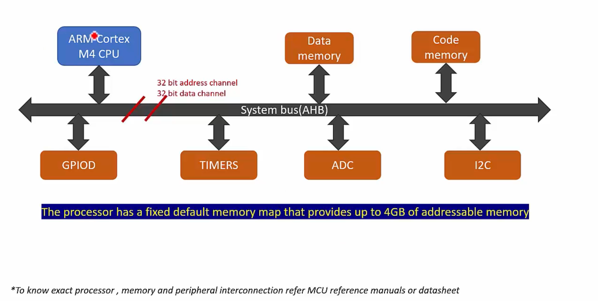
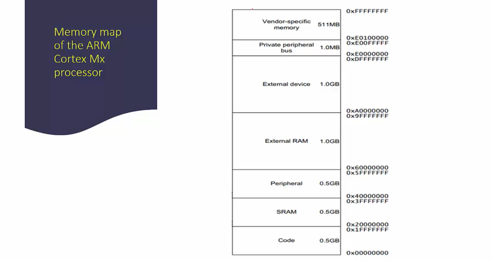
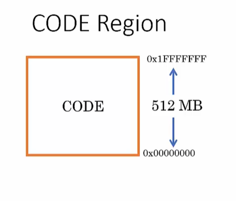
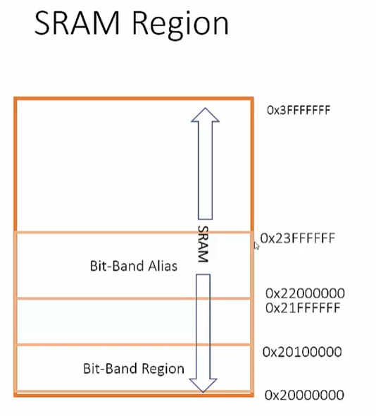

# Memory Map and Bus Interfaces of the Processor
1. Memory map explains mapping of different peripheral registers and memories in the processor addressable memory location range.

2. The processor, addressable memory location range, depends upon the size of the address bus.

3. The mapping of the different regions in the addressable memory location range is called `memory map`.

4. The `Processor` communicates to the Various Peripherals like ADC, GPIOs, Timers I2C etc. with the help of the System Bus.

5. The `Processor` communicates to the Various memory i.e. `Data Memory` and `Code Memory`.

5. `Code memory` is the place where we keep the instructions of the program.

6. `Data memory` is the place where we store the data of the program.

7. System Bus has two buses:
  1. Address Channel or Address Bus
  2. Data Channel or Data Channel.

8. All these buses are of 32 bits.

## How does the value from the ADC register is stored into the Memory?
- The processor puts the address of the ADC register to the Address Bus.
- When the address matches to the ADC register the register is unlocked and the value in the ADC
  register is put on the Data Bus.
- The Value is then `stored` in the `internal register` of the CPU.
- The Value from the `internal register` is then stored to the `Data Memory`.

- LOAD and STORE instruction will do the above listed tasks.

## Address
- In the ARM Cortex Mx processors the range of the address is fixed from 0x0000_0000 to 0xFFFF_FFFF.
- There are 4 Gigs addresses in total in the ARM Cortex Mx Architecture.

## Memory Architecture
- This is fixed in the ARM Cortex Mx Architecture.

## Code Regions

- The code memory in the ARM Cortex Mx processors is from 0x0000_0000 to 0x1ffff_ffff.

- If the processor generates the address 0x0 that means it wants to talk to the code memory.

- The peripheral registers should not fall under this region.

- This is the region where the MCU vendors should connect CODE memory.

- Different types of Code memories are:
  - Embedded Flash
  - ROM
  - OTP
  - EEPROM

- Processor by default fetches vector table information from this region right after reset.

- In the MCU we can change it using the Boot Pins of the Microcontroller, i.e. Boot from SDCard, Boot From Emmc etc.

## SRAM Regions

- The SRAM Region comes in the next 512 MB of memory space after the CODE region.

- Its primarily for conencting the SRAM mostly on-chip SRAM.

- The first 1MB of the SRAM region is a bit addressable.

- Program Code can be executed from this region.

## Peripheral Regions
- The peripheral regions also has the size of 512MB.

- It is used mostly for the on-chip peripherals.

- Like the SRAM region, the first 1MB of the peripheral region is bit addressable if the optional bit band features is included.

- This is an execute never region.

- Trying to execute code from this region will trigger fault exception.

