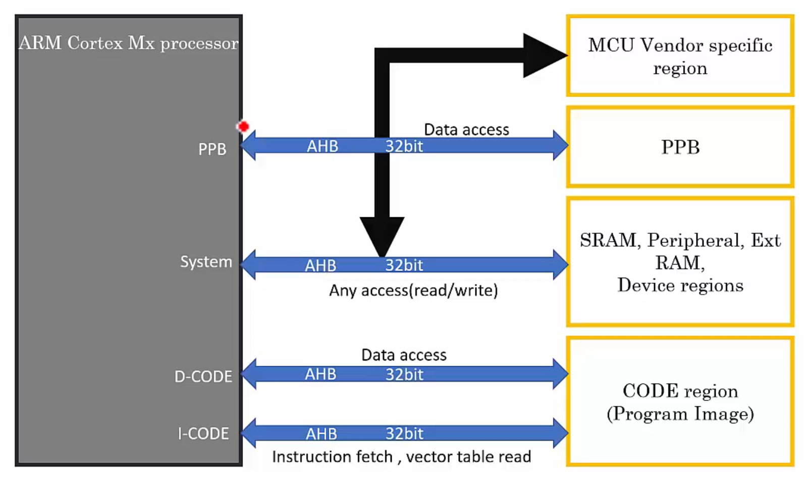

# Bus protocol and Bus Interfaces
- In Cortex Mx processors the bus interfaces are based on the advanced microcontroller bus architecture (AMBA) specification.

- AMBA is a specification designed by ARM which governs standard for on-chip communication inside the system on chip.

- AMBA specification supports several bus protocols.
  - AHB Lite(AMBA High Performance Bus)
  - APB (AMBA Peripheral Bus)

- The on chip communication between the processor, peripherals and the memory is governed by the AMBA bus interface.

## AHB and APB
- `AHB Lite` bus is mainly `used` for the `main bus interface`.

- `APB bus` is `used` for `private peripheral access` and some `on-chip peripheral access` using an AHB-APB bridge.

- `AHB Lite bus` is majorly `used` for `high-speed communication` with the peripherals that demand high operation speed.

- `APB bus` is `used` for `low speed communication` compared to the AHB.

- Most of the peripherals which do not require high operation speed are connected to APB bus.

    

## Note:
- The processor gives out 4 AHB bus interfaces:
    1. PPB (Private Peripheral Bus)
    2. System Bus
    3. D-CODE
    4. I-CODE

- 2 are given to access the code region, i.e. `D-CODE` and `I-CODE`.

- `I-CODE` fetches the Instructions and the Vector Table from the code memory.

- `D-CODE` fetches the Data from the code region.

- `System Bus` connects the on chip peripherals of the MCU, processor also communicates with the SRAM(Data Memory). Data Memory access i.e. the RAM Access is also carried out by this Bus. Communication with the Various Peripherals of the MCUs like ADC, DAC, Timers and CAN are also done over this bus.

- `Private Peripheral Bus` is used for the communication between the `processor` and `private peripheral region` i.e. the NVIC, System timer, and System Control Block.

## Bus Arbitor
- The D-Bus, I-Bus and S-Bus are connected to the Bus Matrix.

- Bus Matrix is given by the microcontroller vendor to synchronize multiple bus access from different bus masters.

- There are several Bus Masters in the Cortex Mx Processors like ETH, DMA, USB and Processor is itself a Bus Master.

- Bus Arbitor takes care of the proper access to the bus when there are multiple masters present.

- All these are part of the AHB Bus Matrix Engine.

