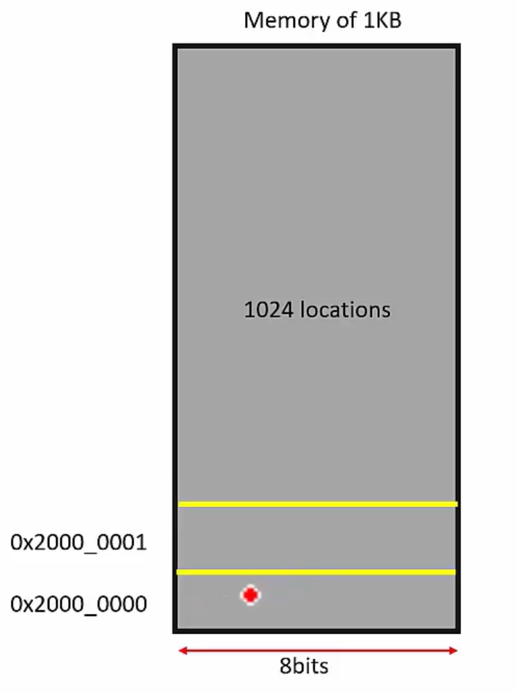

# Bit Banding
- It is the capability to address a single bit of a memory address.

- This feature is optional i.e. MCU manufacturer supports it or many do not support this feature(Reference Manual).

## Example
- If we have a memory of 1KB then we have total 8 x 1024 bits.

- Address of 1st byte is 0x2000_0000 and the address of the next byte is 0x2000_0001.

- Read From 0x2000_0000 1 byte, hence it is called byte addressable.

## Read 1 Byte
- Load a Byte.
```rust
LDRB R0, [R1] // R1 has the address of 0x2000_0000, R0 will store the byte in it.
```

## Read 2 Byte
- Load a Half Word.
```rust
LDRH (Hw)
```

## Read a Word
```rust
LDR (w)
```

## To read only 4 bits
- It is not possible to read half byte.




