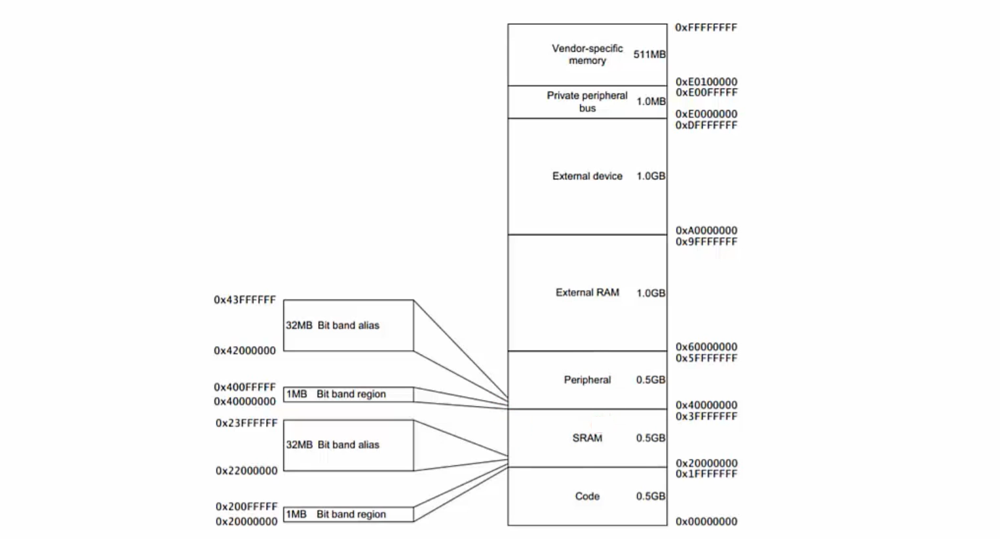
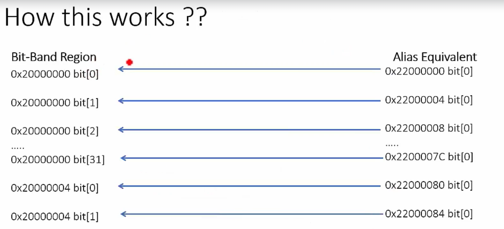
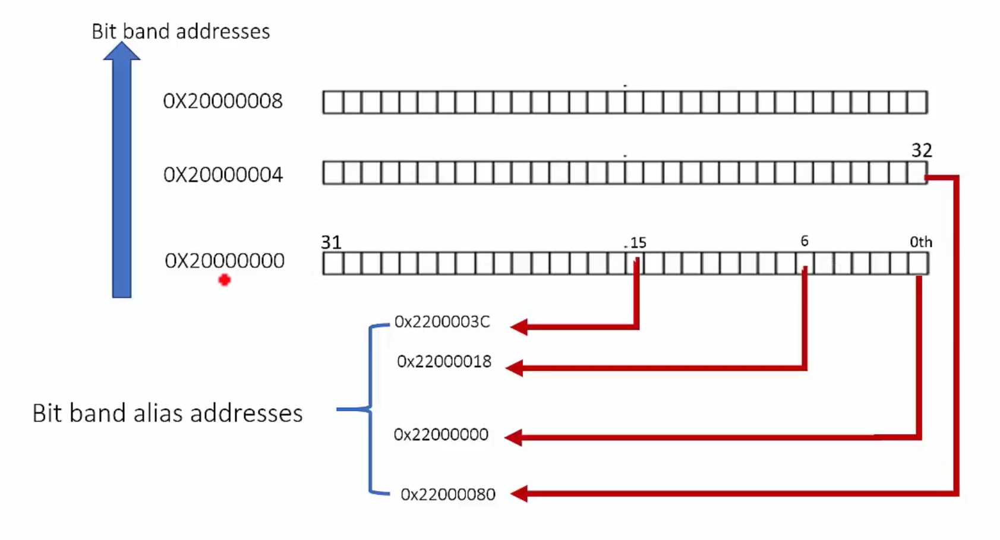

# Bit Banding
- It is the capability to address a single bit of a memory address.
- This feature is optional i.e. MCU manufacturer supports it or many do not support this feature(Reference Manual).

## Example
- If we have a memory of 1KB then we have total 8 x 1024 bits.
- Let the address of 1st byte is 0x2000_0000 and the address of the next byte is 0x2000_0001.
- Read From 0x2000_0000 1 byte, hence it is called byte addressable.


## Read 1 Byte
- Load a Byte, `LD means Load`, `R means Register` and `B means Byte`.
```rust
LDRB R0, [R1] // R1 has the address of 0x2000_0000, R0 will store the byte in it.
```

## Read 2 Byte
- Load a Half Word, `LD means Load`, `R means Register` and `H means Half Word`.
- The Architecture is of 32 bit so the Half Word means 2 bytes.
```rust
LDRH (Hw)
```

## Read a Word
- To read the entire 32 bit we will use the LDR instruction.
```rust
LDR (w)
```

## To read only 4 bits
- It is not possible to read half byte or 4 bits of Data.
- Bit Banding is the feature by which we can read a single bit of the memory location.
- The location 0x2000_0000 has 8 bits.
- In Bit Banding each bit will be given a memory location.

## How to make the 0th Bit of the Memory Location 0x2000_0000 as 1?
- Initialize the R1,
```bash
LDR R1, =0x20000000;
```

- Load the Byte from R1 to R0
```bash
LDRB R0, [R1];
```

- Make the 0th bit as 1
```bash
MOVS  R2, #1           ; Safely handles the immediate value 1
ORRS  R0, R0, R2       ; Universally valid bitwise OR operation
```

- Store
```bash
STRB R0, [R1]
```

- This is the normal methods.

## Using the Bit Banding Method
- We can use the Bit Banding Method to change the bit using the LDRB command.
- Alias address is used to access the bit.
```bash
LDRB R0, [Address]
```
- This bit banding feature is only available for the SRAM and the Peripheral region not for other regions.

- See the memory for the region which comes under the Bit Banding.







- The regions for SRAM and peripherals include optional bit-band regions.

- Bit Banding provides atomic operations to bit data.
