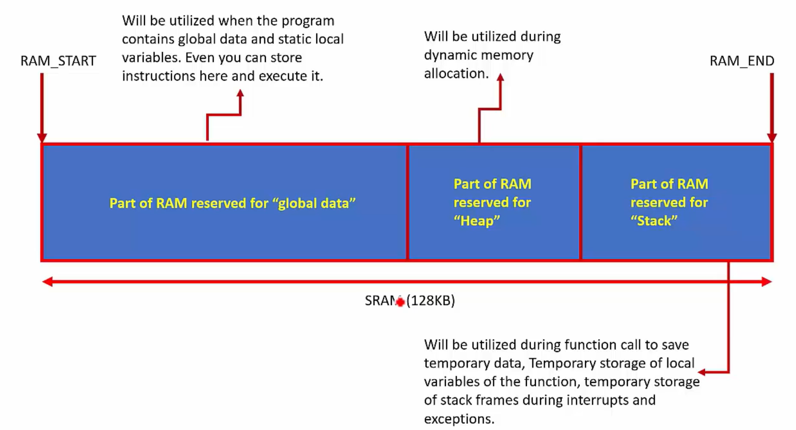

# Stack Memory
1. Stack memory is the part of the main memory(Internal RAM or external RAM) reserved for the `temporary storage of data`(transient data).

2. It is mainly used during the `function, interrupt/exception handling`.

3. It is accessed in the Last in First Out fashion(LIFO).

4. The stack can be accessed using PUSH and POP instructions or using any memory manipulation instruction(LD, STR).

5. The stack is traced using a stack pointer(SP) register. PUSH and POP instructions after (decrement or increment) stack pointer register(SP,R13).

## Stack Memory Uses
1. The temporary storage of the processor register values.

2. The temporary storage of local variables of the function.

3. During system exception or interrupt, stack memory will be used to save the context(some general-purpose registers, processor status register, return address) of the currently executing code.

    

4. The boundaries of the Stack Memory, Heap Memory and the Global Data is decided by the user in the linker script.

## Stack Operation Model
- In the ARM Cortex Mx processor stack consumption model is Full Descending(FD).

## Different Stack operation models
- Full Ascending Stack (FA)
- Full Descending Stack (ARM Cortex Mx processors use this)
- Empty Ascending Stack (EA)
- Empty Descending Stack (ED)

