# Different Stack Model Operation

## Full Ascending Stack
- Stack pointer points to the Lowest Memory Address Initially.

- Data is present at the point where Stack Pointer Points.

- First the Stack Pointer is incremented `SP = SP + 1`.

- Then the Value will be pushed `STK[SP] = VAL`

- Ascending means the SP is going towards the higher memory addresses with each operation.

    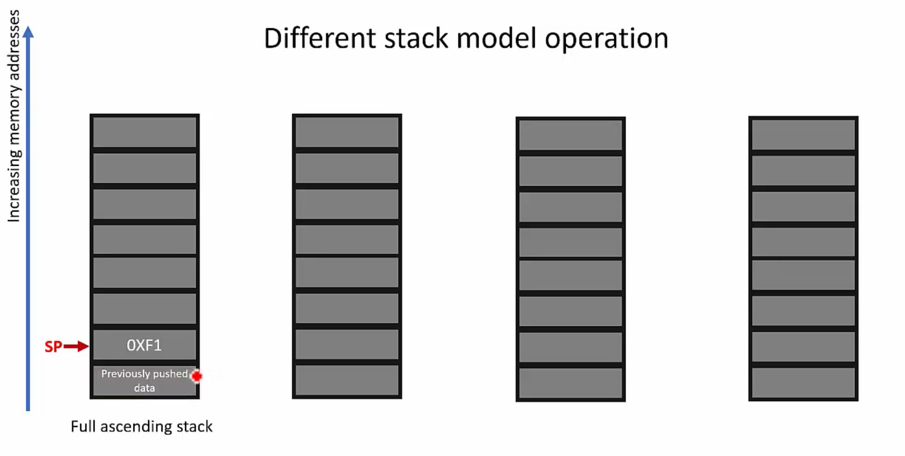

    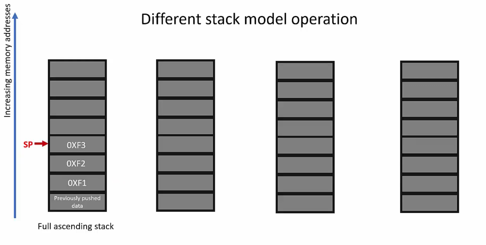

## Full Descending Stack
- Stack pointer points to the Highest Memory Address Initially.

- Data is present at the point where Stack Pointer Points.

- First the Stack Pointer is incremented `SP = SP - 1`.

- Then the Value will be pushed `STK[SP] = VAL`

- Descending means the SP is going towards the lower memory addresses with each operation.

    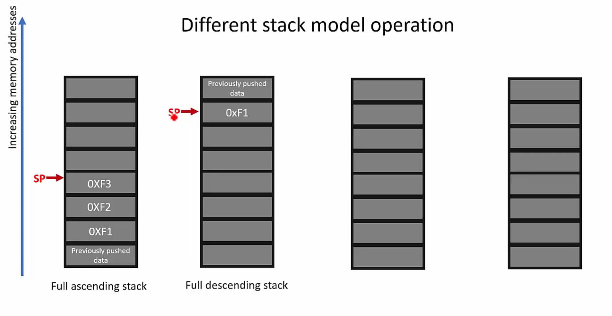

    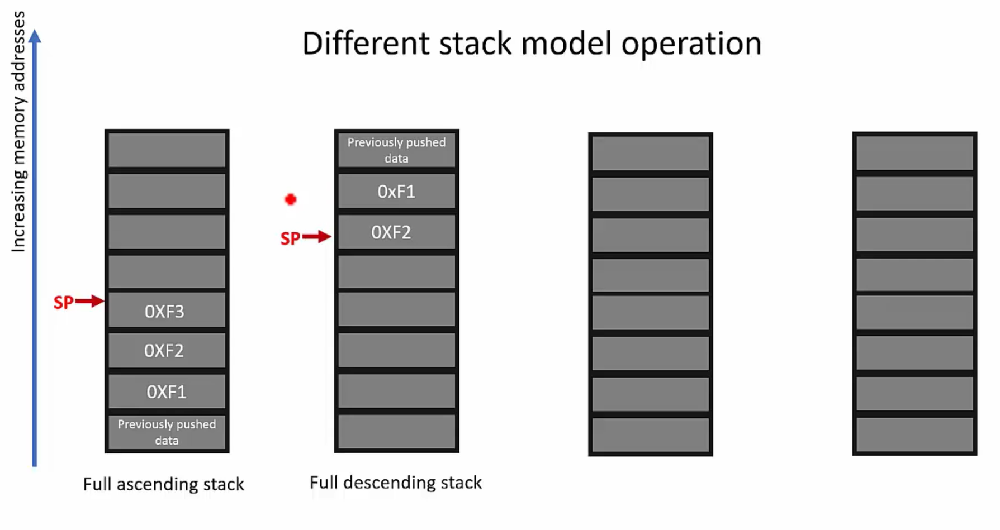

## Empty Ascending Stack
- Stack pointer points to the Lowest Memory Address Initially.

- Data is not present at the point where Stack Pointer Points.

- First the Value will be pushed `STK[SP] = VAL`

- Then the Stack Pointer is incremented `SP = SP + 1`.

- Ascending means the SP is going towards the higher memory addresses with each operation.

   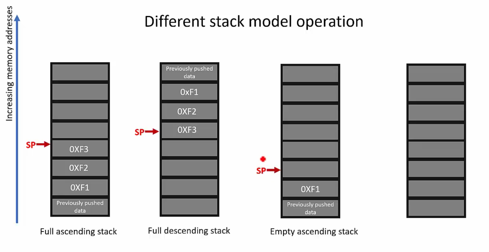

   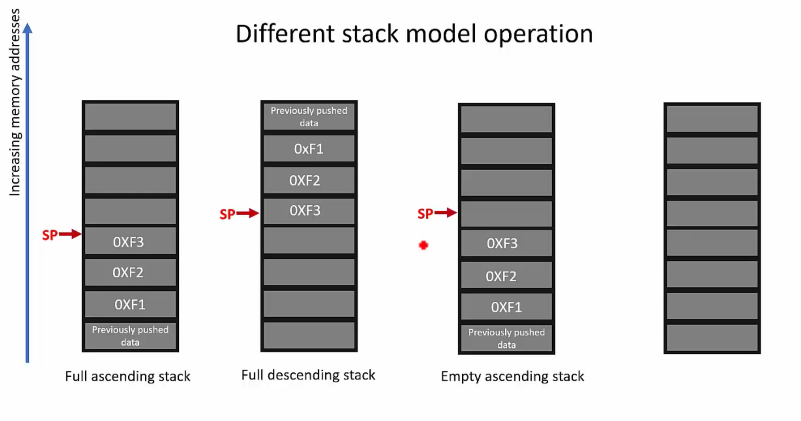

## Empty Descending Stack
- Stack pointer points to the `Highest Address Initially`.

- Data is not present at the point where Stack Pointer Points.

- First the Value will be pushed `STK[SP] = VAL`

- Then the Stack Pointer is decremented `SP = SP - 1`.

- Ascending means the SP is going towards the lower memory addresses with each operation.

   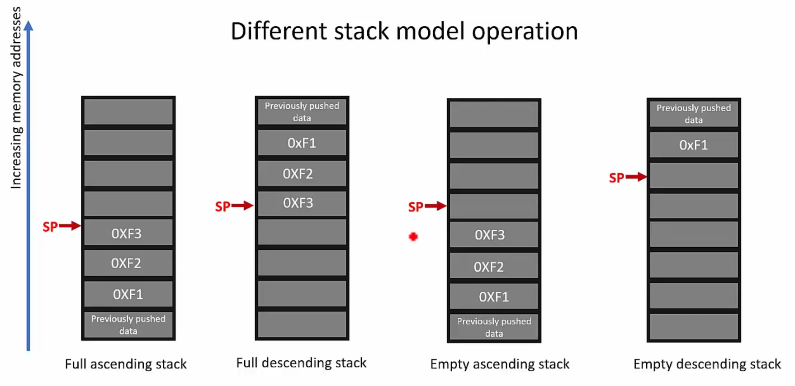

   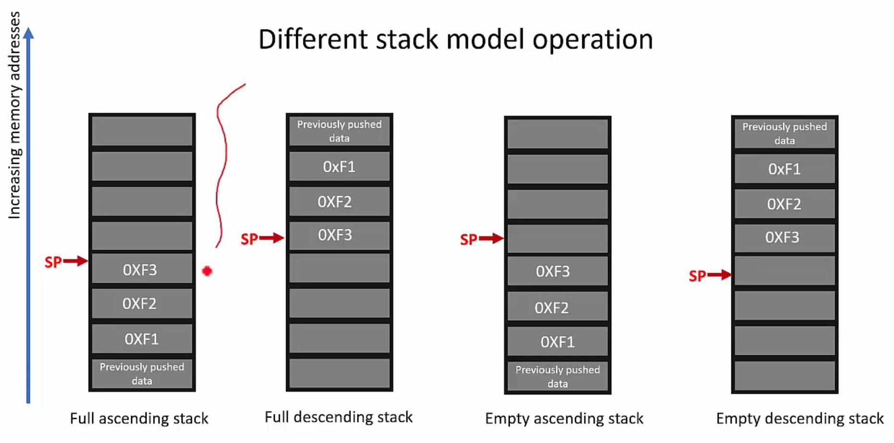

## Example explaining the operations on the Stack Memory
- Initially the SP will point to the previously pushed data.

   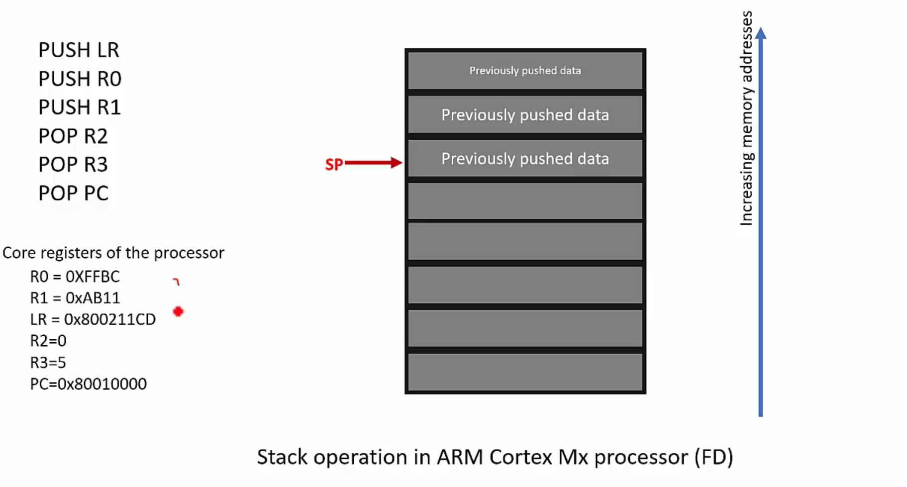

- PUSH LR, will push the value of the LR = 0x8002_11CD into the Stack at the SP.

   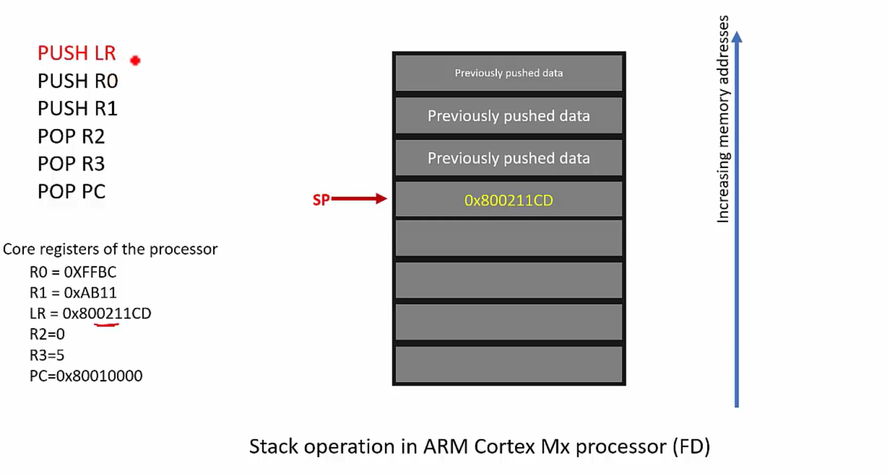

- PUSH R0, will push the value of the R0 to the stack.

- PUSH R1, will push the value of the R1 to the stack.

   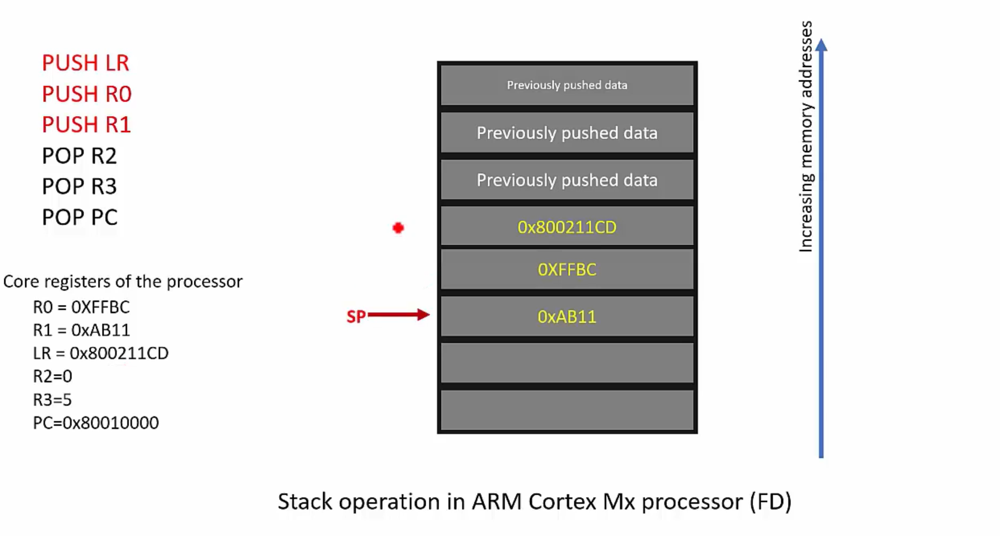

- POP R2 will put the value at the SP in the R2 and decrement the SP.

   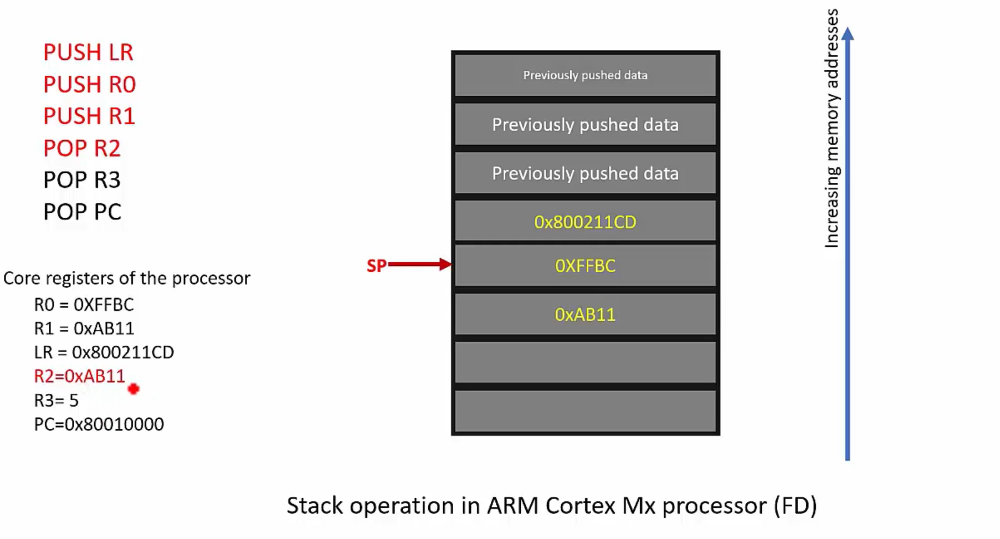

- POP R3 will put the value at the SP in the R3 and decrement the SP.

   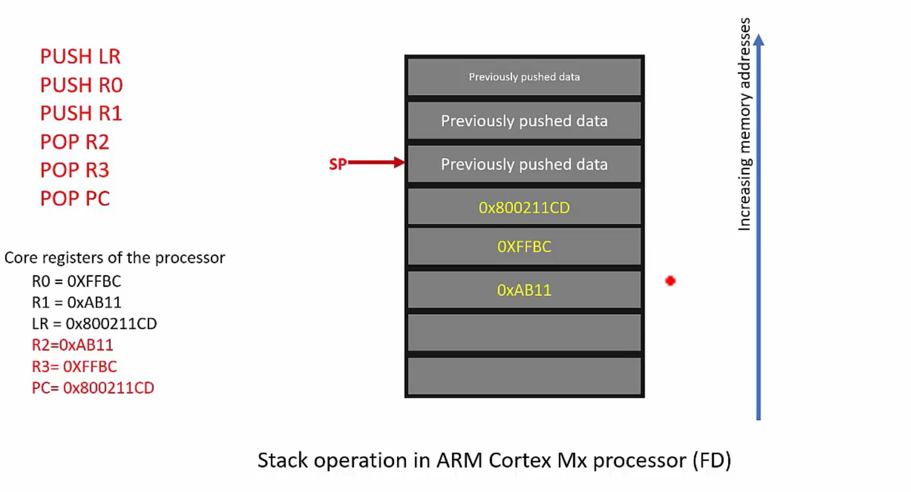

