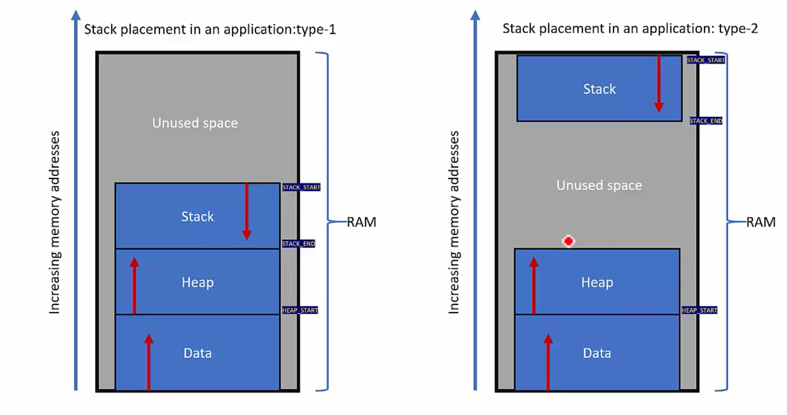

# Stack Placement in the application
1. The Stack Memory is a part of the RAM.

2. It is used to store the temporary data in it.

## Which part of the RAM is used to store the Stack Memory?
1. The initial part of the RAM is used to store the Data Part of the Program.

2. Then the HEAP is placed and after that the Stack is placed.

3. It is decided in the linker script that where the Stack, Heap and Data Memory will be placed.

   

4. The Stack Memory can be placed at 2 positions:
   - Type 1: It can be placed just after the Heap Section.
   - Type 2: It can be placed at the end of the Ram Section, i.e. 1KB of Stack at the end of the RAM.

5. Since the Stack Model in the ARM Cortex M processor is full descending, stack consumption occurs in top to bottom direction.

6. Heap Consumption happens in Bottom to Top Direction.

7. Between the Stack and the Heap there is Unused Space of the RAM.

