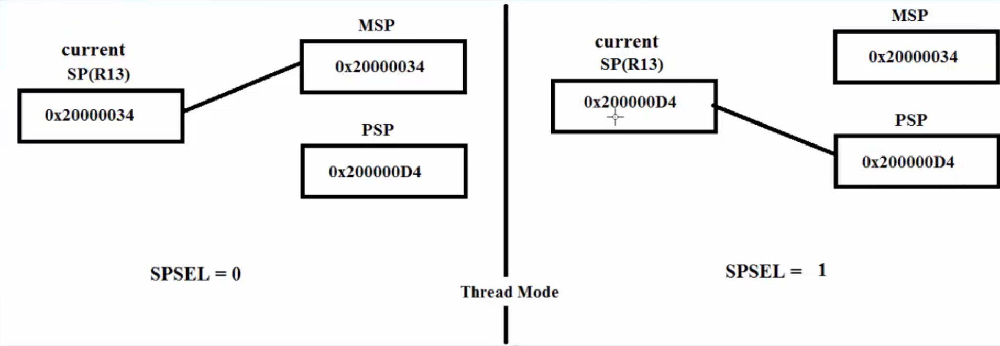
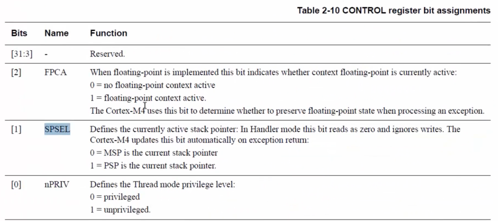

# Banked Stack Pointer
1. Cortex M processor physically has 3 stack pointers:
   - SP (Register R13 is the Stack Pointer)
   - MSP (Main Stack Pointer)
   - PSP (Process Stack Pointer)
SP is called as current stack pointer.

2. After processor reset, by default MSP is selected as the current SP. The data of the MSP is copied into the SP(R13) `SP <- MSP`.

3. Thread Mode can change the Current Stack Pointer to the Process Stack Pointer `SP <- PSP` by configuring the CONTROL register's SPSEL bit.
   - If the `SPSEL = 0` bit of the Microcontroller is reset the Stack Pointer gets the value of the MSP i.e. `SP <- MSP`.
   - If the `SPSEL = 1` bit of the Microcontroller is set the Stack Pointer gets the value of the MSP i.e. `SP <- PSP`.

   

   

4. If the processor is in `Handler Mode` code execution will always use `Main Stack Pointer` as the C`urrent Stack Pointer(SP)`. The SPSEL bit will make no difference to the Stack Pointer in the `Handler Mode`.

5. MSP will be initialized automatically by the processor after the reset by reading the content of the address 0x0000_0000.

6. If the PSP is to be used then the PSP should be initialized to valid stack address in the code.

