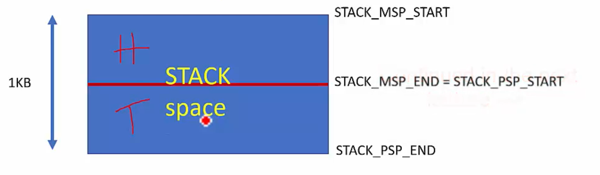

# Stack Exercise
- When the STM32 Project is put in the debug mode and the main() is executing.
- In the Registers tab, go to the R13 which is named as the SP.

- In the linker file for Cortex M33 Non Secure:
    - `Top of the Stack` = `Origin of the RAM` + `Length of the RAM`

    - Origin of the RAM = 0x80A00000 
    - Length of the RAM = 0x00600000
    - Top of the Stack =  0x81000000

    ```c
    /* Set stack top to end of RAM, and stack limit move down by
    * size of stack_dummy section */
    __StackTop = ORIGIN(RAM) + LENGTH(RAM);
    __StackLimit = __StackTop - SIZEOF(.stack_dummy);
    PROVIDE(__stack = __StackTop);
    ```

- In the linker file for Cortex M4:
    - `_estack` symbol defines the end of text.
    - `_estack` = ORIGIN(RAM) + LENGTH(RAM).
    - Origin of RAM = 0x20000000
    - Length of RAM = 0x00020000 = 128 * 1024 (Total Size of the RAM)
    - End of the RAM = 0x20020000
    - Initially stack is initialized to this address, since the Stack Operation mode in the Cortex M4 is Full Descending.
    - `_sidata` is start of the data section.
    - `_edata` is the end of data section.

## Change the Stack Pointer from the Main Stack Pointer to Process Stack Pointer
- In the `Thread Mode` the Stack Pointer is pointing to the `Process Stack Pointer`.
- In the `Handler Mode` the Stack Pointer is pointing to the `Main Stack Pointer`.

- We will divide the Stack Space into two portions:
  - First 512 Bytes for the PSP region(Thread Mode).
  - Second 512 Bytes for the MSP region(Handler Mode).

  

## How will we access the PSP and MSP registers from our C Code?
- We will be using the Inline Assembely code.
- The instructions used will be the MSR and MRS.

```c
#define DDR_START 0x80A00000
#define DDR_SIZE (6 * 1024 * 1024)
#define DDR_END ((DDR_START) + (DDR_SIZE))

#define STACK_MSP_START   DDR_END
#define STACK_MSP_END     (STACK_START + 512)
#define STACK_PSP_START   STACK_MSP_END

int fun(int a, int b, int c, int d)
{
    return a+b+c+d;
}

__attribute__((naked)) void change_sp_to_psp()
{
    // 1. Store the address of the Stack to the PSP in these 2 steps
    // Initializing the value of R0
    __asm volatile("LDR R0, =STACK_PSP_START");

   // MSR moves the contents of a general purpose register(R0) into the specified special register(PSP)
    __asm volatile("MSR PSP, R0");

   // 2. Make the SP point to the PSP
   // Change the SPSEL bit of the Control Register as 1 for PSP.
   // MOV Instruction works only for the 16 bit value, for 32 bit value use the LDR Instruction
   __asm volatile("MOV R0, #0X02");

   // Move the content of the R0 to Control Register
   __asm volatile("MSR CONTROL, R0");

   // Now we will move back to the main function
   __asm volatile("BX LR");
}

void SVC_Handler()
{
    printf("We are in SVC Handler");
}

void generate_exception(void)
{
    /*
     * SVC Instruction can be executed by the thread mode code
     * to get some services from the Kernal Level Code.
     * It is used in the OS Environment where application involves
     * seperate Kernel Code and User Code.
    */
    __asm volatile("SVC #0X02");
}

int main(void)
{
    // This function will change the Stack Pointer to the PSP in the Handler Mode
    // Otherwise the Stack Pointer will point to the MSP in the Thread Mode
    change_sp_to_psp();

    int ret;
    ret = fun_add(1, 4, 5, 6);
    printf("Result = %d\n", ret);

    // SP will now point to PSP after this
    generate_exception();
}

```

- We cannot use the C Macro in the assembely code.
- We will be using the follwoing assembely code.

```asm
.equ label, <value>
```

```c
#define DDR_START 0x80A00000
#define DDR_SIZE (6 * 1024 * 1024)
#define DDR_END ((DDR_START) + (DDR_SIZE))

#define STACK_MSP_START   DDR_END
#define STACK_MSP_END     (STACK_START + 512)
#define STACK_PSP_START   STACK_MSP_END

int fun(int a, int b, int c, int d)
{
    return a+b+c+d;
}

__attribute__((naked)) void change_sp_to_psp()
{
    // 1. Store the address of the Stack to the PSP in these 2 steps
    // Initializing the value of R0
    __asm volatile(".equ DDR_END, (0x80A00000 + (6 * 1024 * 1024))");
    __asm volatile(".equ PSP_START, (DDR_END - 512)");
    __asm volatile("LDR R0, =PSP_START");

   // MSR moves the contents of a general purpose register(R0) into the specified special register(PSP)
    __asm volatile("MSR PSP, R0");

   // 2. Make the SP point to the PSP
   // Change the SPSEL bit of the Control Register as 1 for PSP.
   // MOV Instruction works only for the 16 bit value, for 32 bit value use the LDR Instruction
   __asm volatile("MOV R0, #0X02");

   // Move the content of the R0 to Control Register
   __asm volatile("MSR CONTROL, R0");

   // Now we will move back to the main function
   __asm volatile("BX LR");
}

void SVC_Handler()
{
    printf("We are in SVC Handler");
}

void generate_exception(void)
{
    /*
     * SVC Instruction can be executed by the thread mode code
     * to get some services from the Kernal Level Code.
     * It is used in the OS Environment where application involves
     * seperate Kernel Code and User Code.
    */
    __asm volatile("SVC #0X02");
}

int main(void)
{
    // This function will change the Stack Pointer to the PSP in the Handler Mode
    // Otherwise the Stack Pointer will point to the MSP in the Thread Mode
    change_sp_to_psp();

    int ret;
    ret = fun_add(1, 4, 5, 6);
    printf("Result = %d\n", ret);

    // SP will now point to PSP after this
    generate_exception();
}

```

- When the generate_exception() is called the SP points to the MSP.
- When we will leave the generate_exception() the SP will again point to the PSP.

## Summary
1. Physically there are two stack pointer registers in the Cortex-M processors.
2. `Main Stack Pointer(MSP)`: 
   This is the default Stack Pointer used after the reset and is used for all exception/interrupt
   handlers and for codes which run in the thread mode.
3. `Process Stack Pointer(PSP)`:
   This is an alternate stack pointer that can be used in thread mode. It is usually used for the
   application task in embedded systems snd embedded OS..
4. After the power-up, the processor automatically initializes the MSP by reading the first location
   of the Vector Table.

## Changing the SP
- To access the MSP and the PSP in assembely code, MSR and MRS instructions can be used.

- In the `C` program, naked functions (`C` like assembely functions which doesn't epilogue and prologue 
  sequences) to change the currently selected stack pointer.
