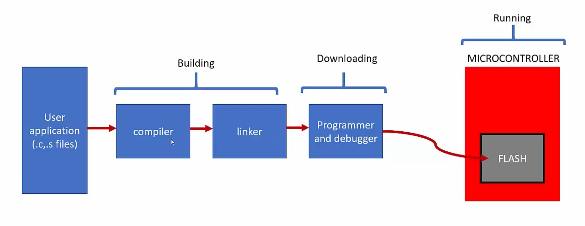

# Building and running bare metal executables for ARM target using GNU Tools
- Toolchain installation
- Understanding compilation process of a C program for an embedded target without using an IDE.
- Writing Microcontroller Startup file for STM32F4 MCU
- Writing `C` startup code (Code which runs before main())
- Understanding different sections of the relocatable object file(.o files)
- Writing linker script file from scratch and understanding section placements.
- Linking multiple .o files using linker script and generating application executable(.elf, bin, hex)
- Loading the final executable on the target using OpenOCD and GDB client.

## Sample `C` program
- The Task Scheduler example will be taken to perform all the above listed tasks.
- The Tasks will be performed on the files in the Workspace Directory.

