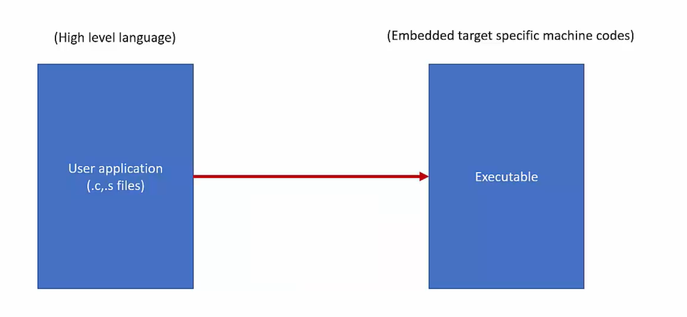
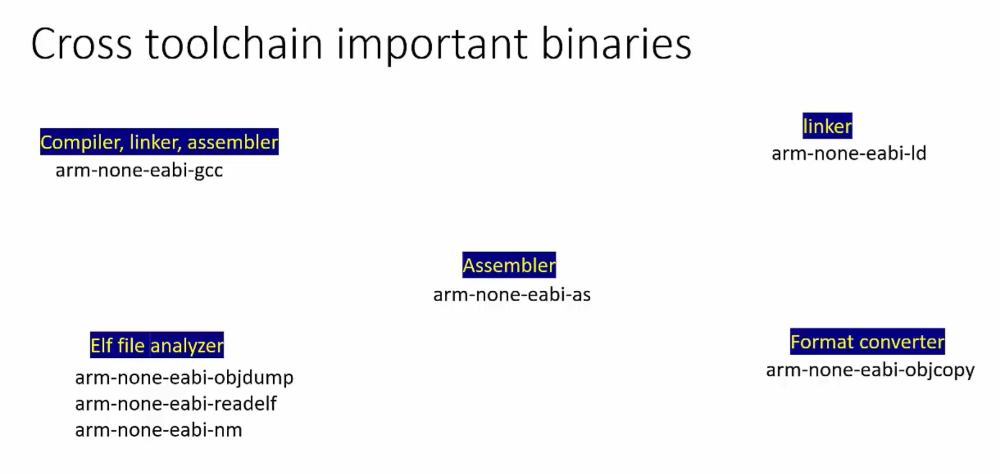

# Cross compilation and Toolchains
- We write the program in the .c files.
- They have to be converted to the embedded target specific machine codes.

    

- For this target specific code conversion of the .c programs we do cross compilation.

## What is cross compilation?
- Cross-compilation is a process in which the cross-toolchain runs on the host machine(PC) and creates executables that run on different machine(ARM)
- PC(Host Machine) & STM32 Board(Target Machine)

## Cross Compilation Tool Chains
- Toolchain or a cross-compilation toolchain is a collection of binaries which allows the user to compile, assemble and link the application.

- It also contains binaries to debug the application on the target.

- Toolchain also comes with the other binaries which help to analyze the executables
    - Dissect different sections of the executable
    - Disassemble
    - Extract symbol and size information
    - Convert executable to other formats such as bin, hex.
    - Provides 'C' standard libraries.

## Popular Tool-chains:
1. GNU Tools(GCC) for ARM Embedded Processors(Free and Open-source).
2. ARMCC for ARM Ltd.(Ships with KEIL, code restriction version, requires licensing).

- The most popular tool chain used is GNU's Compiler Collections(GCC) Toolchain used by the STM32CubeIDE.

## Downloading the GCC Toolchain for ARM Embedded processors:
- GCC Toolchain is installed by default with the STM32CubeIDE installation and the version can be seen in the `STM32CubeIDE -> Windows -> Preferences -> STM32Cube -> Toolchain Manager`.

- It can be downloaded from the official website. [GCC Toolchain](https://developer.arm.com/downloads/-/gnu-rm)

- Install the toolchain and run the following command on the command prompt to see if it is installed or not.

```bash
arm-none-eabi-gcc
arm-none-eabi-gcc --version
```

- All the binaries are installed in the `C:\Program Files (x86)\GNU Arm Embedded Toolchain\10 2021.10\bin` folder.

## Cross compilation toolchain binaries
- Compiler, linker and assembler : `arm-none-eabi-gcc` not only does `compilation`, it also `assembles` and `links` object files to create final executable file.

- Assembeler Binary:`arm-none-eabi-gcc-as` is the binary which convert the assembely level language file to machine codes assembler.

- Linker Binary: `arm-none-eabi-gcc-ld` is the command used to invoke the linker explicitly.

- Elf File Analyzer Binary: `arm-none-eabi-objdump`, `arm-none-eabi-readelf`, `arm-none-eabi-nm`.

- Format Convertor Binary: `arm-none-eabi-objcopy`

- And there are several other binaries.

    


