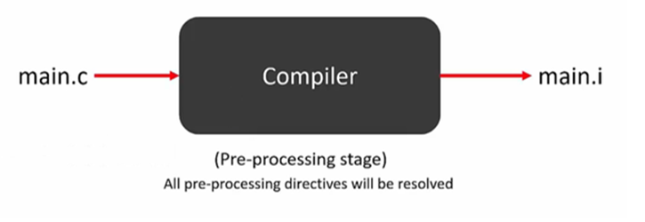
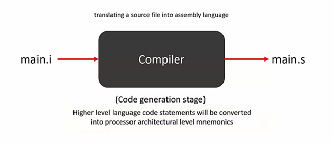
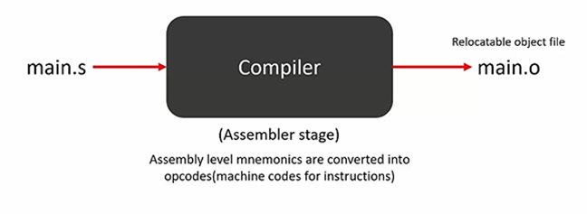
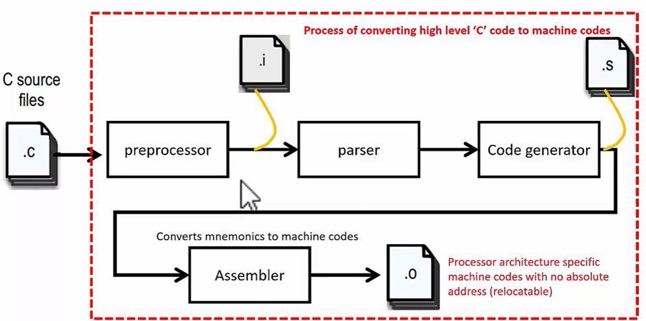
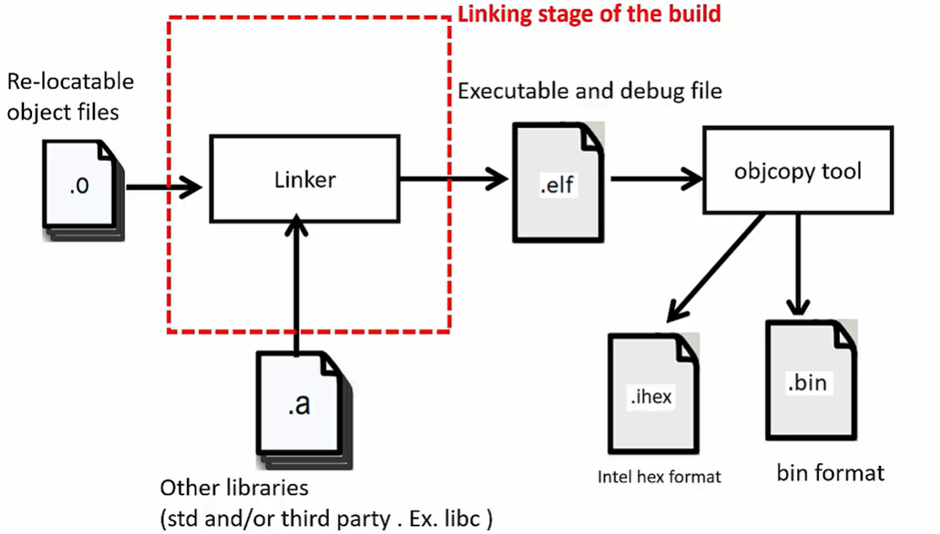
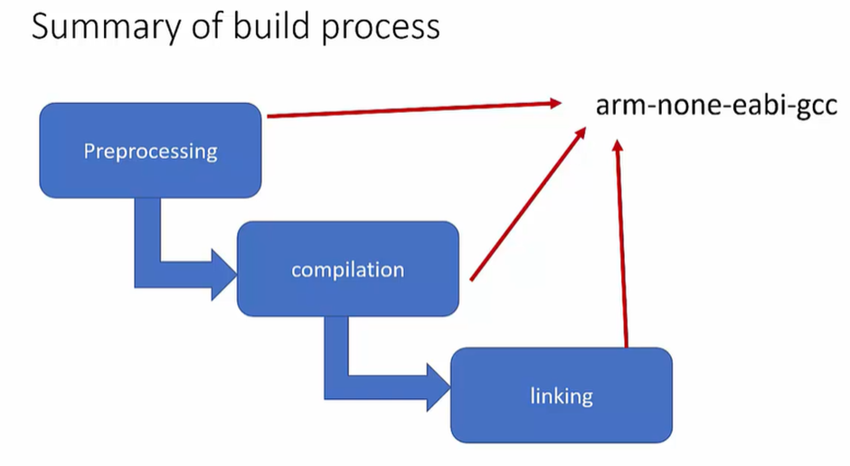

# Build Process
## 1. Preprocessing Stage
- In this all the pre-processing directives of the source file will be resolved.
- The pre-processing directives such as all #includes, the C macros, or the conditional compilation macros of the source file will be resolved.
- A pre-processed file is created which has an extension of `.i`.

    

## 2. Code generation stage
- In this stage high level language code statements will be converted into processor architecture level mnemonics.

    

## 3. Assembler Stage
- Assembly level mnemonics are converted into opcodes (machine codes for instructions).

    

## Compilation Process
- This is the entire compilation process.

- The `.i` and `.s` files are not created by default, we have to give the compiler instructions to make these files.

- In parsing the checks will be carried out for the C syntax.

    

## Linking Process
- All the relocatable object files will be taken up by the linker.

- This process resolves all the symbols and other information, and it will merge all the sections of the .o file.

- It creates one executable, that is the final executable file, it is named as `.elf` file.

- `.elf` stands for executable and linkable format.

- All relocatable files are merged together to create one executable.

    

- These executable files can be converted to some other formats like binary format with extension of `.bin` and intel hex format file i.e. `.ihex` using the tool object copy.

    

