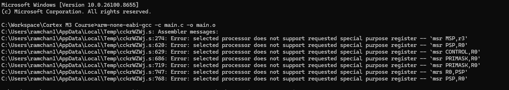

# Compilation and Compiler Flag
## To compile and assemble the file but not link it
- We will invoke the cross compiler.
```bash
    arm-none-eabi-gcc
```

- We will write the `input file name` after that.
```bash
    arm-none-eabi-gcc main.c
```

- We will then mention the `compiler argument` and the `output file`.
```bash
    arm-none-eabi-gcc main.c -o main.o
```

- In this way we are converting the `.c` file to the `.o`(object) file.

- To only compile and assemble the file use the following command and it tells the compiler not to link.
```bash
    arm-none-eabi-gcc -c main.c -o main.o
```



- The assembler couldn't understand these assembely mnemonics, because we didn't mention the processor architecture.

- There are several processors available for ARM Cortex M architecture so we will have to mention for which CPU we are trying to build compile the file.

```bash
    arm-none-eabi-gcc -mcpu=cortex-m4 -mthumb -c main.c -o main.o
```

- We are using the Thumb Instruction Set Architecture so we will put the argument `-mthumb`.

## To create the assembely file for the .c file
- We are stopping the compilation at the .s file and not letting the compiler create the .o file.
```bash
    arm-none-eabi-gcc -mcpu=cortex-m4 -mthumb -S main.c -o main.s
```

## Note:
- `arm-none-eabi-gcc` is for the cross-compiler toolchain.
- `main.c` is input file.
- `-o` is the flag which mentions generating output file.
- `-mcpu=cortex-m4` is mentioning the processor of the target machine for which we are compiling the file.
- `-mthumb` Cortex M processors only support thumb state i.e. they only support those instructions which are under thumb instruction set architecture. 
- If -mthumb is not used, then -marm is invoked, so the cross compiler assumes that ARM Architecture instructions will be supported by default.
- `-std=gnu11` refers to the standard of the GNU we are using.
- `-Wall` enables all the warnings.


